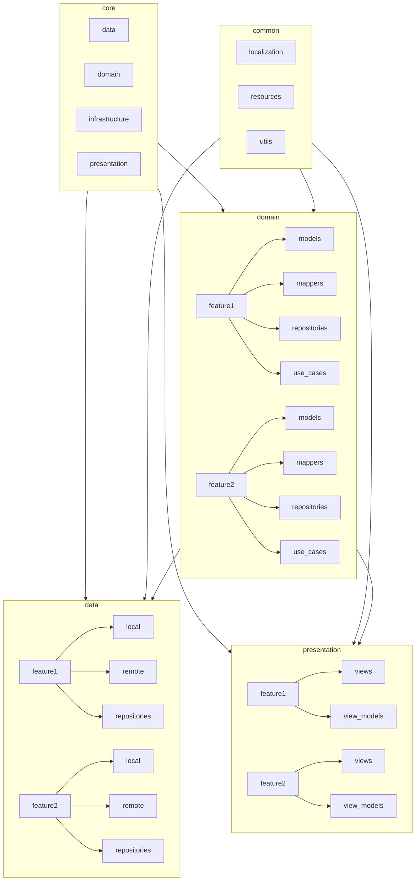

# Architecture

The project is structured based on the Clean Architecture principles and from @ResoCoder's [Flutter TDD Clean Architecture explanation](https://resocoder.com/2019/08/27/flutter-tdd-clean-architecture-course-1-explanation-project-structure/). It provides a clear and modular structure for building applications by dividing them into distinct layers.



The project foldering is structured like this:

```
lib
├── core
│   ├── data
│   ├── domain
│   ├── infrastructure
│   └── presentation
├── common
│   ├── localization
│   ├── resources
│   └── utils
├── data
│   ├── feature1
│   │   ├── local
│   │   └── remote
│   │   └── repositories
│   └── feature2
│   │   ├── local
│   │   └── remote
│   │   └── repositories
├── domain
│   ├── feature1
│   │   ├── models
│   │   ├── mappers
│   │   ├── repositories
│   │   └── use_cases
│   └── feature2
│       ├── models
│       ├── mappers
│       ├── repositories 
│       └── use_cases
├── presentation
│   ├── feature1
│   │   ├── views
│   │   └── view_models
│   └── feature2
│       ├── views
│       └── view_models
└── main.dart
```

## Layers

### Data

Consists of the application data. It encapsulates all the data access logic, including retrieving, saving, updating, and deleting data. This layer provides the implementation of the repository pattern that abstracts the underlying data sources (i.e. local or remote), allowing the rest of the application to remain independent of the specific implementation details.

### Domain

It is responsible for encapsulating the business logic and rules of the application. This layer defines interfaces and interacts with the Data layer through repositories, allowing the application to fetch and manipulate data without worrying about the specific data sources or implementation details. Use cases are the entry point to the Domain layer and are responsible for executing the business logic and transforming the data which will be used by the Presentation layer.

### Presentation

The Presentation layer is responsible for the user interface (UI) and user interaction aspects of the application. It handles the rendering of data, user input, and presentation logic. In Flutter, this layer typically consists of widgets and classes that define the UI components and their behavior. The Presentation layer communicates with the Domain layer to fetch data and execute business logic. It serves as a bridge between the user and the underlying functionality of the application.

### Core

Contains the components which are shared across the application such as cross-cutting concerns (logging, analytics) and dependency injection.

### Common

Contains the components which are shared across the application such as localization, resources, and utilities.
