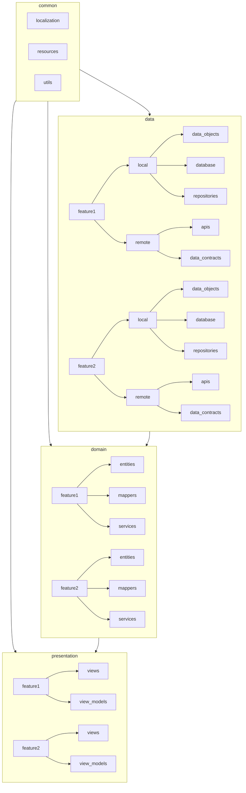
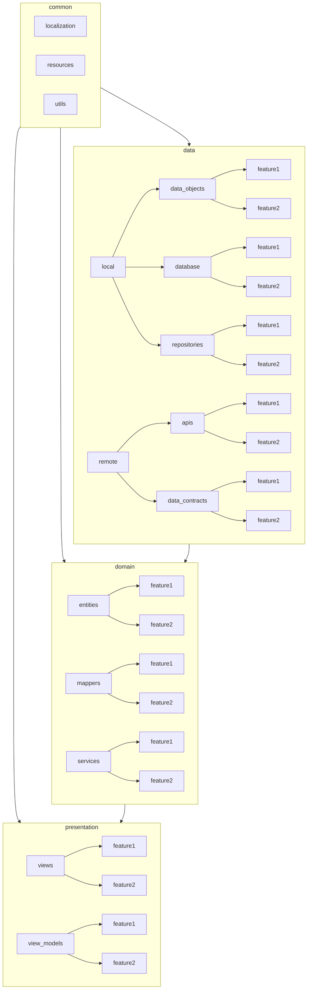

# Architecture Diagrams

## Current

```mermaid
graph TD
    feature1_domain[domain]
    feature1_domain_entity[entities]
    feature1_domain_services[services]
    feature1_domain_mapping[mapping]
    feature1_data[data]
    feature1_data_apis[apis]
    feature1_data_contracts[data_contracts]
    feature1_data_persistence[persistence]
    feature1_presentation[presentation]
    feature1_presentation_views[views]
    feature1_presentation_view_models[view_models]

    feature2_domain[domain]
    feature2_domain_entity[entities]
    feature2_domain_services[services]
    feature2_domain_mapping[mapping]
    feature2_data[data]
    feature2_data_apis[apis]
    feature2_data_contracts[data_contracts]
    feature2_data_persistence[persistence]
    feature2_presentation[presentation]
    feature2_presentation_views[views]
    feature2_presentation_view_models[view_models]

    core_domain[domain]
    core_domain_mapping[mapping]
    core_domain_entities[entities]

    core_data[data]
    core_data_apis[apis]
    core_data_contracts[data_contracts]
    core_data_persistence[persistence]

    core_infrastructure[infrastructure]
    core_infrastructure_logging[logging]
    core_infrastructure_navigation[navigation]
    core_infrastructure_platform[platform]

    core_presentation[presentation]
    core_presentation_views[views]
    core_presentation_view_models[view_models]

    shared[shared]
    shared_localization[localization]
    shared_resources[resources]

    subgraph "shared"
        shared_localization
        shared_resources
    end

    subgraph "core"
        core_domain-->core_domain_mapping
        core_domain-->core_domain_entities

        core_data-->core_data_apis
        core_data-->core_data_persistence
        core_data-->core_data_contracts

        core_infrastructure-->core_infrastructure_logging
        core_infrastructure-->core_infrastructure_navigation
        core_infrastructure-->core_infrastructure_platform

        core_presentation-->core_presentation_views
        core_presentation-->core_presentation_view_models
    end

    subgraph "features"
        feature1
        feature1-->feature1_data
        feature1-->feature1_domain
        feature1-->feature1_presentation

        feature1_data-->feature1_data_apis
        feature1_data-->feature1_data_persistence
        feature1_data-->feature1_data_contracts

        feature1_domain-->feature1_domain_entity
        feature1_domain-->feature1_domain_services
        feature1_domain-->feature1_domain_mapping

        feature1_presentation-->feature1_presentation_views
        feature1_presentation-->feature1_presentation_view_models
    end

    subgraph "features"
        feature2
        feature2-->feature2_data
        feature2-->feature2_domain
        feature2-->feature2_presentation

        feature2_data-->feature2_data_apis
        feature2_data-->feature2_data_persistence
        feature2_data-->feature2_data_contracts

        feature2_domain-->feature2_domain_entity
        feature2_domain-->feature2_domain_services
        feature2_domain-->feature2_domain_mapping

        feature2_presentation-->feature2_presentation_views
        feature2_presentation-->feature2_presentation_view_models
    end

    shared-->core
    shared-->features
    core-->features
```



The project foldering is structured like this:

```
lib
├── core
│   ├── data
│   ├── domain
│   ├── infrastructure
│   └── presentation
├── features
│   ├── feature1
│   │   ├── data
│   │   ├── domain
│   │   └── presentation
│   └── feature2
│       ├── data
│       ├── domain
│       └── presentation
├── shared
│  ├── localization
│  └── resources
├── main.dart
└── service_locator.dart
```

## Proposed

### Feature-first per layer approach



The project foldering is structured like this:

```
lib
├── common
│   ├── localization
│   ├── resources
│   └── utils
├── data
│   ├── feature1
│   │   ├── local
│   │   │   ├── data_objects
│   │   │   ├── database
│   │   │   └── repositories
│   │   └── remote
│   │       ├── apis
│   │       └── data_contracts
│   └── feature2
│       ├── local
│       │   ├── data_objects
│       │   ├── database
│       │   └── repositories
│       └── remote
│           ├── apis
│           └── data_contracts
├── domain
│   ├── feature1
│   │   ├── entities
│   │   ├── mappers
│   │   └── services
│   └── feature2
│       ├── entities
│       ├── mappers
│       └── services
├── presentation
│   ├── feature1
│   │   ├── views
│   │   └── view_models
│   └── feature2
│       ├── views
│       └── view_models
├── main.dart
└── service_locator.dart
```

### Type-first per layer approach



The project foldering is structured like this:

```
lib
├── common
│   ├── localization
│   ├── resources
│   └── utils
├── data
│   ├── local
│   │   ├── data_objects
│   │   │   ├── feature1
│   │   │   └── feature2
│   │   ├── database
│   │   │   ├── feature1
│   │   │   └── feature2
│   │   └── repositories
│   │       ├── feature1
│   │       └── feature2
│   ├── remote
│   │   ├── apis
│   │   │   ├── feature1
│   │   │   └── feature2
│   │   └── data_contracts
│   │       ├── feature1
│   │       └── feature2
├── domain
│   ├── entities
│   │   ├── feature1
│   │   └── feature2
│   ├── mappers
│   │   ├── feature1
│   │   └── feature2
│   └── services
│       ├── feature1
│       └── feature2
├── presentation
│   ├── view_models
│   │   ├── feature1
│   │   └── feature2
│   └── views
│       ├── feature1
│       └── feature2
├── main.dart
└── service_locator.dart
```