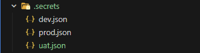
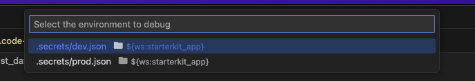

# Multiple Environments

As required by ERNI standards, each project should have the following environments:
- **Development** is used by the developers. Testing should not be done in this environment since it is always changing.
- **Test** will be used by your testers to ensure that the software is error free.
- **UAT** ensures that your software is working as expected in the hands of your intended users.
- **Production** contains the latest version of your software that passed all testing and is generally available to your intended user.

## Setup and Debugging an Environment

Under `.secrets` folder, we can find the different variables used for each environments:



We use [Command Variable](https://marketplace.visualstudio.com/items?itemName=rioj7.command-variable) extension in order to select which environment to run locally. Pressing `F5` will show a picker before debugging the application:



There is a written [article](https://medium.com/@dustincatap/app-environments-in-flutter-and-visual-studio-code-fd956daf9802) that explains this setup.

## Secrets File

These `.secrets` files are formatted as JSON, and each key are passed to Flutter's build arguments as [Dart defines](https://dartcode.org/docs/using-dart-define-in-flutter/). Checkout our [launch.json](../erni_mobile/.vscode/launch.json) on how these are passed.

Below is a sample of a `.secrets` file for the development environment:

```json
{
    "appName": "App (Dev)",
    "appServerUrl": "https://ephblueprint-be.azurewebsites.net",
    "appWebDebugPort": "7072",
    "appId": "ch.erni.mobile",
    "appIdSuffix": ".dev",
    "appUniversalLink": "ephblueprint-fe.azurewebsites.net",
    "iOSDevelopmentTeam": "2A26KBG984",
    "iOSDevelopmentProfile": "ERNI Mobile Blueprint Flutter (Development)",
    "iOSDistributionProfile": "ERNI Mobile Blueprint Flutter (Distribution)",
    "iOSExportMethod": "enterprise"
}
```

If you want to use some values like Google Maps Keys, application suffix IDs, etc., these Dart defines can be accessed in the native platforms. Read more about it [here](https://itnext.io/flutter-1-17-no-more-flavors-no-more-ios-schemas-command-argument-that-solves-everything-8b145ed4285d).

:exclamation: **<span style="color: red">IMPORTANT</span>**

The folder `.secrets` is committed to git by default (for testing purposes), you should uncomment last part of the [.gitignore](../erni_mobile/.gitignore) file to remove it from git.

# CI Pipeline Integration

The `.secrets` file should be uploaded to our CI server and download this file to each of our CI pipelines. We have a custom script (PowerShell) step that extracts the values for the appropriate environment:

```powershell
$secrets = Get-Content ".secrets/<your-env>.secrets" | out-string | ConvertFrom-Json # you must set the secret file to use as a pipeline variable
$dartDefines = ""

foreach ($info in $secrets.PSObject.Properties) {
    $key = $info.Name
    $value = $info.Value
    $dartDefines += "--dart-define `"$key=$value`" "
}

Write-Output $dartDefines
Write-Host "##vso[task.setvariable variable=dartDefines;]$dartDefines"
```

The script creates a part of the build command that contains the Dart defines, stored in `$dartDefines` variable which will be available to the following steps of the pipeline:

```sh
flutter build apk --debug $(dartDefines)
```